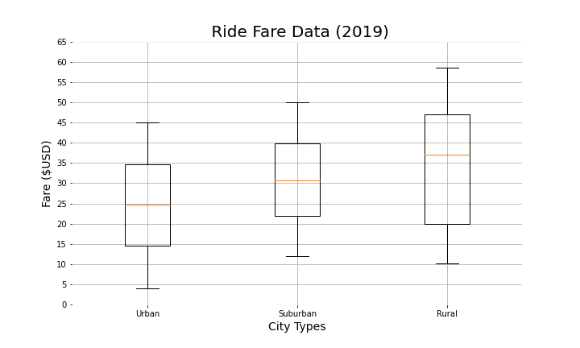

# PyBer_Analysis

# Overview

**Purpose**

The goal is to gather practical information that can benefit future business decisions and optimize profits. With the new analysis, we pay special attention to differences between the three city types, fare trends over time, and we can see the dynamic of supply and demand of drivers to riders. Next we can infer how to adjust prices to maximize profits per city type. The PyBer csv files provided by Omar are city_data.csv, which contains information on the city names, the driver counts in those cities, and the city type, ie. rural, suburban, and urban, and the ride_data.csv, which contains the city names, date and time of the ride, the fare, and the ride_id. With the following information, we will calculate general statistics, visualize data on a scatter plot, via a pie chart, box-and-whisker plots, and line graph. Each chart form will convey a particular angle of the story we hope to uncover.

**Background**
The project allows us to have first hand experience at what it may be like being a data analysis at a python-based ride-share company called PyBer. We were tasked by Omar to do an exploratory analysis on the ride data and city data csv files. Utilizing the matplotlib library to create visuals that will easily convey information about the rider count, driver count, fares, and more. We use jupyter notebooks again as a platform to code in, comment, markdown, and output visuals. Personally, I downloaded jupyter notebooks extension into VS Code and have taken advantage of the outlines feature to keep everything easily assessible as I progress and practice using Git Bash to commit code to GitHub.

# Analysis

## The project module deliverables were as such:

1) Import your data into a Pandas DataFrame.
2) Merge your DataFrames.
3) Create a bubble chart that showcases the average fare versus the total number of rides with bubble size based on the total number of drivers for each city type, including urban, suburban, and rural.
4) Determine the mean, median, and mode for the following:
-   The total number of rides for each city type.
-   The average fares for each city type.
-   The total number of drivers for each city type.
5) Create box-and-whisker plots that visualize each of the following to determine if there are any outliers:
-   The number of rides for each city type.
-   The fares for each city type.
-   The number of drivers for each city type.
6) Create a pie chart that visualizes each of the following data for each city type:
-   The percent of total fares.
-   The percent of total rides.
-   The percent of total drivers.

## The module challenge deliverables were as such:

**Deliverable 1**
1) The total number of rides for each city type is retrieved. (5 pt)
2) The total number of drivers for each city type is retrieved. (5 pt)
3) The sum of the fares for each city type is retrieved. (5 pt)
4) The average fare per ride for each city type is calculated. (5 pt)
5) The average fare per driver for each city type is calculated. (5 pt)
6) A PyBer summary DataFrame is created. (5 pt)
7) The PyBer summary DataFrame is formatted as shown in the example. (5 pt)

**Deliverable 2**
1) A DataFrame was created using the groupby() function on the "type" and "date" columns, and the sum() method is applied on the "fare" column to show the total fare amount for each date and time. (10 pt)
2) A DataFrame was created using the pivot() function where the index is the "date," the columns are the city "type," and the values are the "fare." (10 pt)
3) A DataFrame was created using the loc method on the date range: 2019-01-01 through 2019-04-28. (5 pt)
4) A DataFrame was created using the resample() function in weekly bins and shows the sum of the fares for each week. (10 pt)
5) An annotated chart showing the total fares by city type is created and saved to the "analysis" folder. (10 pt)

**Deliverable 3**
A written report for the PyBer analysis (20 points)

**Results**

_Bubble Chart_ showing PyBer Avg Fares vs Total Number of Rides per city with bubble size correlating to driver count per city

The bubble chart shows the average fare cost compared to the total number of rides. Each bubble is a city color-coded by its city type. the size of the bubble shows the number of drivers in that city. We see that the largest number of drivers are found in urban cities, with the most number of riders, and the cheapest fares. Rural cities tend to have the most variability in fare prices and the fewest number of drivers compared to suburban and urban cities.

_Box-and-Whisker Plots_ for Ride Count, Driver Count, and Fare per Ride Data

Ride count and Driver count have a positive relationship with distinctively more riders and drivers in urban cities than in suburban and rural locations. Prices are inversely related to rider and driver counts. 

_Pie Charts_ showing percent of total fares by city type, percent of total rides by city type, and percent of total drivers by city type

Clearly, urban cities contribute more than 2/3s of all business for Pyber

_**Summary Table**_ shows 

In all three city types, there are at least 2 drivers to every 3 riders. 
There are 6 times more drivers and riders in suburban cities compared to rural cities and 12 times more in urban cities compared to rural cities. 
Drivers make the most in rural cities and least in urban cities.
Rides are slightly more expensive in rural cities compared to urban and suburban cities.

_Multi Line Graph_ showing Total Fare by City Type over time

There is a peak in business between late February and early March of 2019 in all cities.
In rural cities, there is a peak in business at the beginning of April
There is stable high business between late Februrary to the end of April in urban cities.

**Summary**
One recommendation regarding any disparities among the city types may be that there needs to be more incentive for rural city dwellers to use PyBer, standardize a tighter range for fare prices to bring more customers to ride in rural areas. Another could be to lower prices during peak months in suburban and rural cities since most individuals in rural and suburban areas already have means of transportation (often times cars), we would need to make it more convenient for them to use PyBer during those peak travel months (often in the coldest or wettest months of Feb, Mar, April). Lastly, in urban cities, we know the population is already inclined to use PyBer, we can maximize profits by increasing prices in urban cities.

